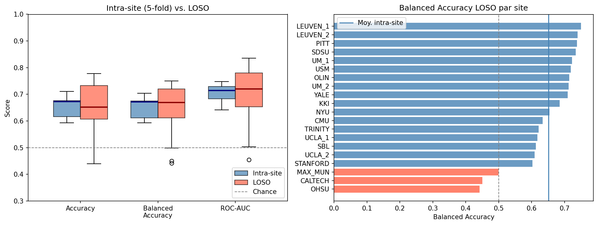
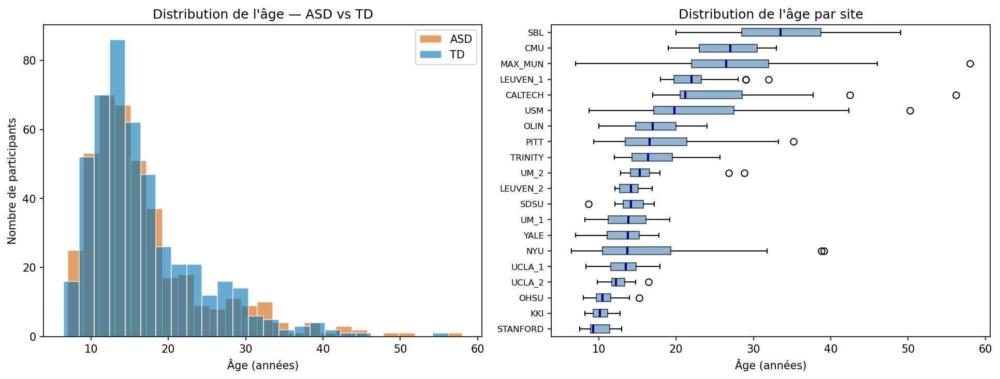
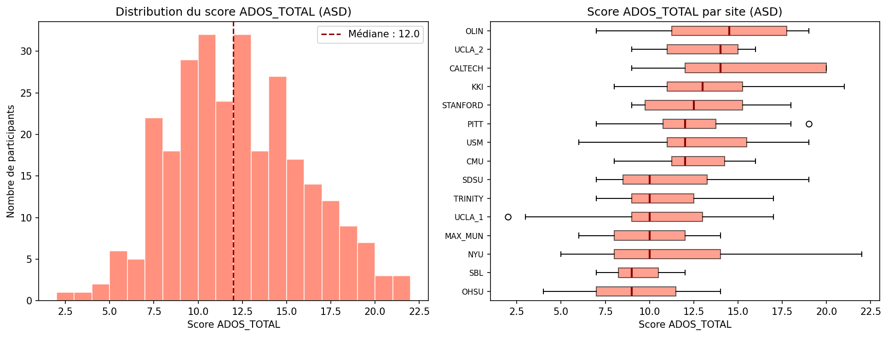
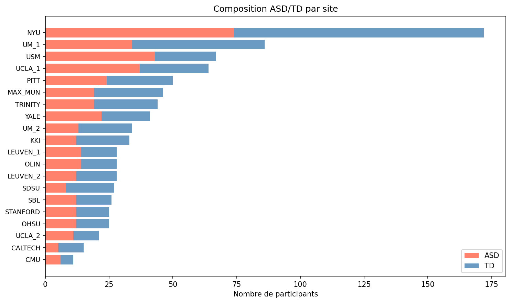
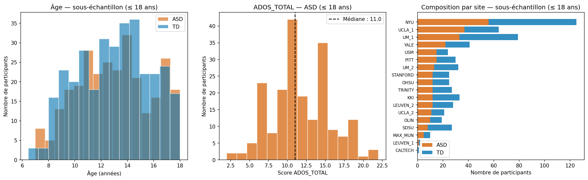
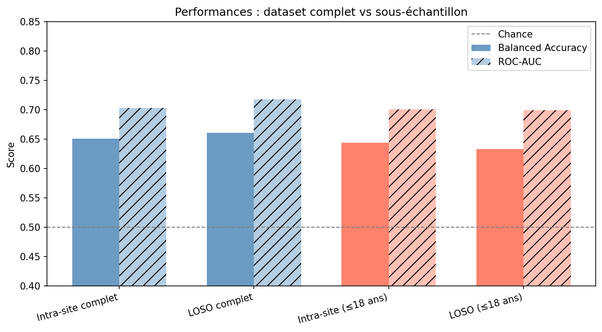
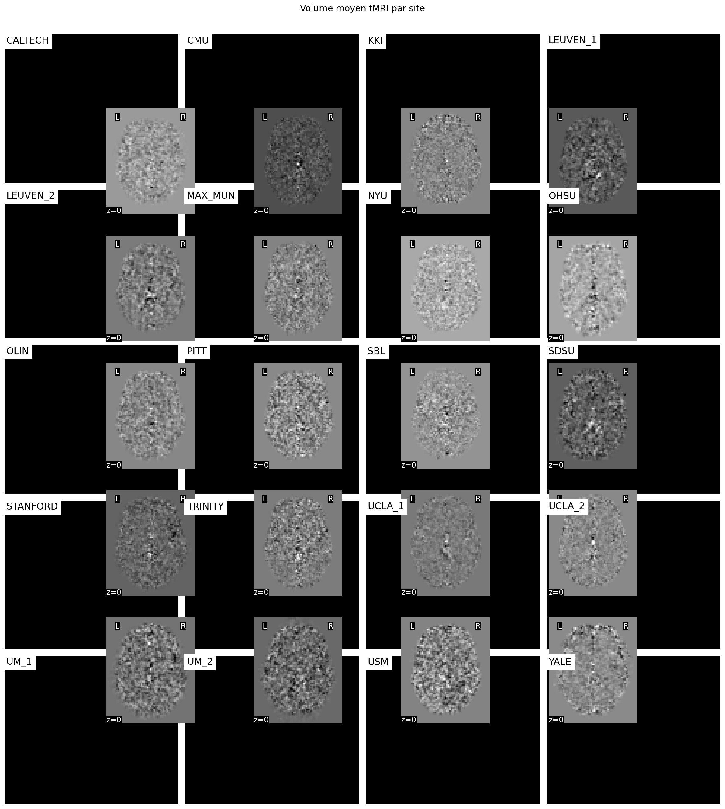
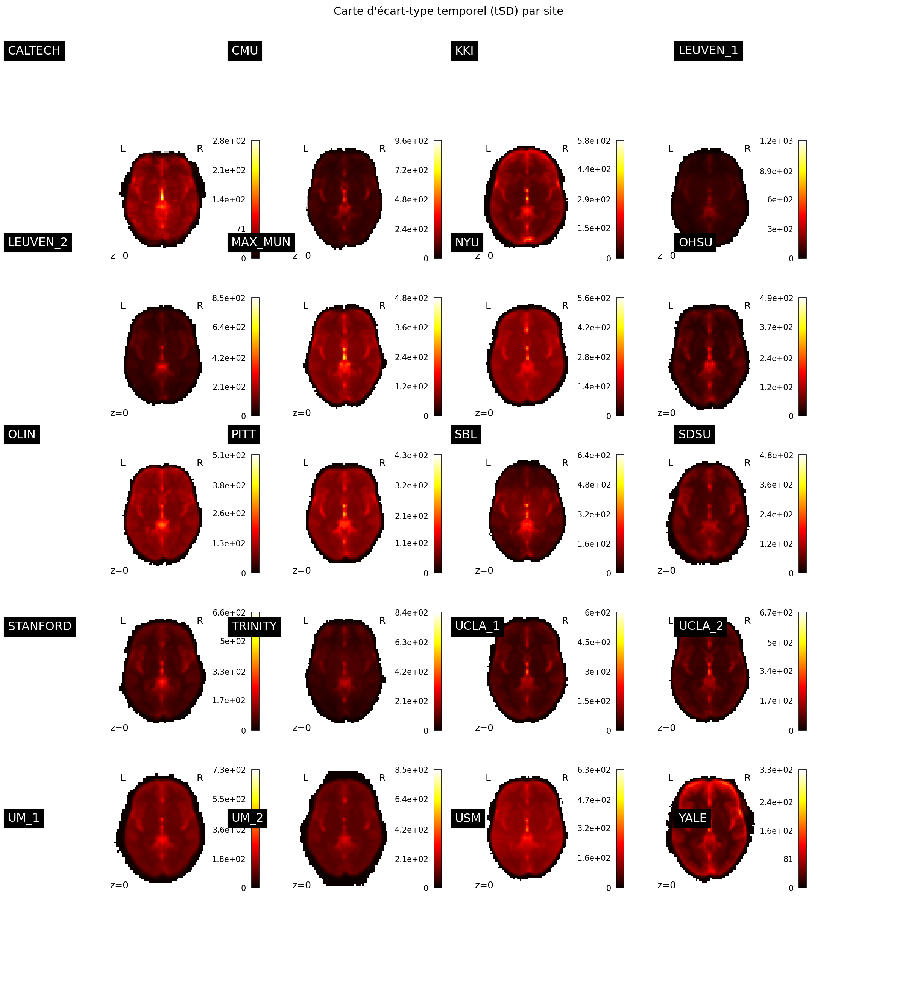
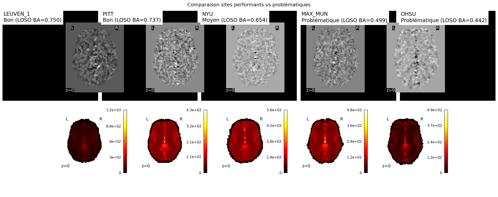
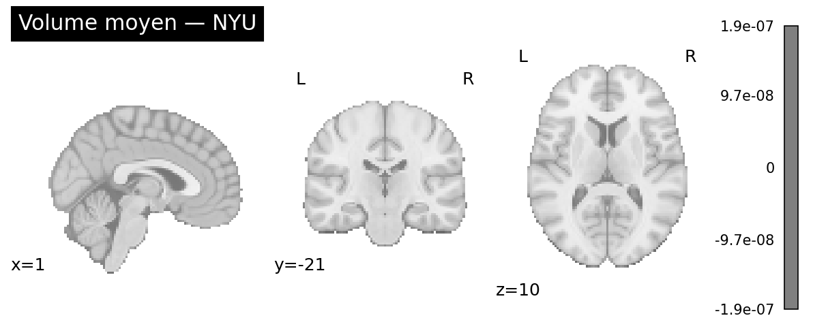

# Francois_Presentation_Projet_ABIDE-fMRI
Présentation des tâches pour le projet ABIDE-fMRI

## 1. Présentation du projet initial :

**Projet initial** :  
**[*Using fMRI Data to Predict Autism Diagnoses with Machine Learning*](https://github.com/brainhack-school2020/abide-fmri)**

### Présentation du projet:  

Le projet initialement réalisé par Emily Chen, Andréanne Proulx et Mikkel Schöttner vise à explorer le potentiel de l’IRMf pour classer des participants présentant un trouble du spectre de l’autisme et des contrôles typiques. Pour cela, ils utilisent des méthodes de machine learning = appliquées à des données d’IRMf au repos et à des mesures de connectivité cérébrale.

### Présentation des données:  
Les données utilisées proviennent du dataset **[ABIDE – Autism Brain Imaging Data Exchange](https://fcon_1000.projects.nitrc.org/indi/abide/)**, une base de données ouverte regroupant des données d’IRMf au repos prétraitées. Le ABIDE contient 1112 jeux de données au total, composés de :
- 539 participants avec un diagnostic de TSA
- 573 participants contrôles typiques (TD)

Le jeu de donnée provient de plus de 20 sites de recherche internationaux.

### Présentation de la méthode:

Le projet repose sur l’extraction de matrices de connectivité fonctionnelle à partir de données d’IRMf au repos. Ces matrices servent ensuite de variables d’entrée pour différents modèles de machine learning.

Les performances des modèles ont été évaluer notamment à l’aide de différentes méthodes de validation croisée. Le but est de comprendre en quoi le choix du modèle et de la stratégie de validation peut influencer la capacité à distinguer les participants ASD des contrôles typiques.

### Présentation des résultats:

En validation group k-fold, les résultats moyens par modèle étaient :
  - Linear SVM ≈ 63.5 %
  - K-nearest neighbors ≈ 55.2 %
  - Arbres de décision ≈ 54.3 %
  - Random forest ≈ 52.6 %

Le SVM linéaire était le plus précis, mais même lui restait loin d’une classification très robuste.

### Interpretation des résultats:

**Les performances de classification observées sont supérieures au hasard (≈50 %) mais loin d'être robuste (pas de très hautes précisions).**

Les résultats montrent que la capacité à prédire ASD vs TD d’après les données IRMf au repos reste limitée, probablement parce que les données proviennent de plusieurs sites avec des profils différents (scanners, âges, méthodes) et que la variabilité inter-sites rend la classification plus difficile.

## 2. Pourquoi ce projet ?

Eva Villeneuve (**[GitHub](https://github.com/psy3019-6973-2026/Villeneuve_Projet_mi-session/tree/main)**) et moi-même avons choisi ce projet car il combine neurosciences cognitives et apprentissage automatique, autour d’un sujet qui nous intéresse : le trouble du spectre de l’autisme.

Le dataset ABIDE est multi-site et est prétraité ce qui en fait un bon point de départ pour étudier des questions comme la validation croisée, la généralisation des modèles et l’impact des effets de site.

Enfin, le projet initial était déjà bien structuré, mais il laissait suffisamment de place pour approfondir certains aspects méthodologiques et proposer des analyses complémentaires.

## 3. Reproduction :

### 1. Cloner le dépôt


```bash
git clone https://github.com/psy3019-6973-2026/Francois_Presentation_Projet_ABIDE-fMRI.git
cd Francois_Presentation_Projet_ABIDE-fMRI
```

### 2. Créer et activer l'environnement
```bash
conda env create -f environment.yml
conda activate env_abide
```

### 3. Préparer les données
**Avertissement** : Cette étape qui télécharge les données ABIDE peut etre longue. 
Selon votre connexion internet, le téléchargement peut prendre **plusieurs heures** (environ 8h). 
 Prévoyez de lancer cette commande en arrière-plan ou avant une nuit.
 
```bash
make prepare
```

## Reproduction complète
Pour reproduire toutes les analyses :
```bash
make run
```

Ou tâche par tâche :
```bash
make tache1   # Validation croisée intra-site vs LOSO
make tache2   # Analyse du sous-échantillon par âge
make tache3   # Visualisation des effets de site fMRI
```
**Avertissement** : La tache 3 peut etre longue a excuter. Une des cellule prend environ 30 minutes.

## Structure du projet

```
├── code/                          # Scripts originaux du projet de base
│   ├── prepare_data.py            # Téléchargement et extraction des features
│   └── *.ipynb                    # Notebooks originaux
├── notebook/                      # Tâches du projet
│   ├── Tache1_validation_croisee_v2.ipynb
│   ├── Tache2_sous_echantillon.ipynb
│   └── Tache3_effets_de_site_fMRI.ipynb
├── data/                          # Données ABIDE (générées par prepare_data.py)
├── output/                        # Features extraites + figures genere
├── Makefile                       # Commandes de reproduction
├── environment.yml                # Environnement conda
└── requirements-modern.txt        # Dépendances pip
```


## 3. Présentation des tâches :

- Tâche 1 et 2 → features extraites : les matrices de connectivité fonctionnelle (BASC064) sous forme de fichiers
- Tâche 3 → fichiers fMRI bruts prétraités (func_preproc.nii.gz)

## Tâche 1 : Comparaison des stratégies de validation croisée selon les sites

### Problème identifié

Dans les bases de données multi-sites comme ABIDE, chaque site utilise
un scanner différent, des paramètres d'acquisition propres et parfois
une population différente. Si les données d'entraînement et de test
proviennent des mêmes sites, le modèle peut apprendre à reconnaître
la signature du scanner plutôt qu'une vraie signature biologique de
l'autisme, ce qui conduit à une surestimation des performances.

### Objectif

Comparer deux stratégies de validation croisée pour mesurer dans quelle
mesure les performances reflètent une vraie capacité de classification
vs un artefact de site :

- **5-Fold stratifié par site (intra-site)** : chaque site est représenté
  proportionnellement dans le train et le test. Le modèle voit les mêmes
  sites à l'entraînement et au test.
- **Leave-One-Site-Out (LOSO)** : un site entier est exclu du train et
  utilisé uniquement pour le test. Répété pour chaque site. Simule le
  scénario réaliste d'application à un nouveau site inconnu.

### Le modèle utilisé : régression logistique
#### Vulgarisation scientifique

Une regression logistique est un modèle lineaire.

**C'est quoi un modèle linéaire :**

Le modèle c'est la machine qui prédit ASD ou TD.

Ici, le modèle linéaire fait une addition pondérée des connexions avec le poids 
(connexion 1 × poids 1 + connexion 2 × poids 2 + connexion 3 × poids 3 + ...)

**C'est quoi une regression logistique :**

La régression logistique est un modèle linéaire, mais elle va une étape plus loin : elle transforme le score final en une probabilité entre 0 et 1.
- Proche de 1 = "probablement ASD"
- Proche de 0 = "probablement TD"

**qu'est ce qu'on obtient avec tout ca ?**

On obtient trois choses : 

1. **Accuracy** :
combien de fois le modele a eu juste

2. **Balanced accuracy** :
Par exemple, sur un groupe de 9 TD et 1 ASD, un modèle qui dit "tout le monde est TD" obtient 90% d'accuracy, mais il n'a détecté aucun ASD... :(
La balanced accuracy corrige ça en calculant séparément le taux de bonne détection chez les ASD, et le taux de bonne détection chez les TD
Puis elle fait la moyenne des deux.
Donc dans cet exemple, le modèle qui avant avait 90% d'accuracy en ignorant complètement les ASD obtient maintenant 50% (le niveau du hasard)

3. **ROC-AUC** :

La note qu'on donne au modèle après avoir regardé toutes ses prédictions à tous les seuils possibles.
- ROC-AUC = 0.5 → modèle nul (équivalent au hasard)
- ROC-AUC = 0.7 → correct 
- ROC-AUC = 1.0 → modèle parfait

Pour réaliser une régression logistique, j'ai fais : 
- Chargement des features ABIDE (matrice de connectivité BASC064)

```python
base_model = Pipeline([
    ("scaler", StandardScaler()),   # normalise les connexions
    ("clf", LogisticRegression(max_iter=1000, random_state=42))  # modèle
])
```
Maintenant que nous avons fait la regression logistique, notre but est d'évaluer le modèle. C'est ce qu'on appelle la **validation croisée**

### Comparer les deux stratégies de validation croisée
#### Validation croisée 1 : 5-Fold stratifié par site (intra-site)

Cette stratégie simule ce qui se passe quand on entraîne et teste sur les **mêmes sites**. Donc le modèle a déjà "vu" ces sites à l'entraînement.

Le 5-fold stratifié par site découpe chaque site en 5 groupes en s'assurant que chaque site est toujours représenté dans l'entraînement ET le test

Concrètement :

- On prend NYU → coupe en 5 groupes
- On prend CMU → coupe en 5 groupes
- On prend PITT → coupe en 5 groupes
- ...

Pourquoi 5 ?

Avec 1 seul fold → on test sur un groupe qui est peut-être facile ou difficile par hasard → résultat pas fiable

Avec 5 folds → on test sur 5 groupes différents → on fait la moyenne → résultat beaucoup plus stable et fiable

Note : pour les sites avec très peu de participants (ex: CALTECH, CMU), le nombre de folds est réduit  automatiquement pour éviter des groupes trop petits.

**Comment c'est implémenté :**

La fonction `kfold_within_site` découpe chaque site séparément en 5 groupes, puis assemble les groupes de tous les sites pour former chaque fold. Si un site a trop peu de participants, le nombre de folds est réduit automatiquement.

Pour les détails du code, voir : 
`notebook/Tache1_validation_croisee_v2.ipynb`

**Résultats : Intra-site (5-fold stratifié par site)**

| Fold | Accuracy | Balanced Accuracy | ROC-AUC |
|------|----------|-------------------|---------|
| 0 | 0.710 | 0.704 | 0.748 |
| 1 | 0.616 | 0.612 | 0.683 |
| 2 | 0.672 | 0.671 | 0.729 |
| 3 | 0.676 | 0.675 | 0.714 |
| 4 | 0.593 | 0.593 | 0.641 |
| **Moyenne** | **0.654** | **0.651** | **0.703** |

**Interprétation**
Le modèle obtient une balanced accuracy de 0.651, ce qui veut dire que la regression logistique apprend quelque chose de réel, car il est bien au-dessus du hasard (0.5)

J'aurai penser que le modèle serait meilleur puisqu'il connaît déjà les sites, mais il obtient seulement 65% parce que le modèle voit les mêmes sites mais pas les mêmes personnes, il doit toujours généraliser à de nouveaux participants. 
Cela montre que le signal biologique de l'autisme dans la connectivité cérébrale doit etre faible.

Les 5 folds donnent des scores qui varient entre 0.593 et 0.7, ce qui montre que le résultat dépend du groupe testé 

#### Validation croisée 2 : Leave-One-Site-Out (LOSO)

Contrairement au 5-fold intra-site, le LOSO teste le modèle sur des sites qu'il a jamais vus à l'entraînement

Concrètement, avec 20 sites :
- Itération 1 : entraîne sur 19 sites, teste sur CALTECH
- Itération 2 : entraîne sur 19 sites, teste sur CMU
- ...
- Itération 20 : entraîne sur 19 sites, teste sur YALE

Comme on a 20 sites, on répète 20 fois (une itération par site)

Le but c'est de simuler ce qui se passerait si on appliquait le modèle à un nouvel hôpital inconnu.
On veut donc repondre a la question : 
**Est-ce que le modèle généralise bien à des données qu'il n'a jamais vues ?**

**Comment c'est implémenté :**

La fonction `LeaveOneGroupOut` de scikit-learn génère automatiquement les itérations, à chaque tour, un site différent est mis de côté 
pour le test et le modèle est entraîné sur les 19 autres sites.

La moyenne finale est **pondérée par le nombre de participants** par site, les grands sites (NYU=172) comptent plus que les petits (CMU=11) dans la moyenne globale.

Pour les détails du code, voir : 
`notebook/Tache1_validation_croisee_v2.ipynb`

**Résultats LOSO (sites interressant)**

*Tableau complet des 20 sites disponible dans le notebook.*

| Site | Balanced Accuracy | ROC-AUC |
|------|-------------------|---------|
| LEUVEN_1 | 0.750 | 0.663 |
| PITT | 0.737 | 0.777 |
| NYU | 0.654 | 0.725 |
| MAX_MUN | 0.499 | 0.503 |
| CALTECH | 0.450 | 0.560 |
| OHSU | 0.442 | 0.455 |
| **Moyenne pondérée** | **0.661** | **0.718** |

**Interprétation des résultats LOSO :**
Nous voulions répondre a la question : 

Est-ce que le modèle généralise bien à des données qu'il n'a jamais vues ?
Et bien cela **dépend du site**


Sites qui généralisent le mieux : LEUVEN_1, LEUVEN_2, PITT → balanced accuracy de 0.737 a 0.750
→ Le modèle arrive à prédire ASD vs TD même sans avoir vu ces sites

Sites qui sont dans le seuil du hasard : OHSU, CALTECH, MAX_MUN (balanced accuracy inferieur à 0.5)
→ Le modèle échoue complètement sur ces sites (pourquoi ?)


 **Note:**
 J'ai regardé la descriptons des sites où le seuils est inferieur au hasard
- OHSU (n=25, 48% ASD)
- CALTECH (n=15, 33% ASD)
- MAX_MUN (n=46, 41% ASD)
 
La proportion ASD/TD est raisonnable pour les trois sites. Donc l'échec de généralisation n'est pas dû à un déséquilibre des classes

C'est probablement un effet de site (des caractéristiques d'acquisition différentes que le modèle ne reconnaît pas)

Pour CALTECH avec un n=15, le résultat est aussi peu fiable statistiquement


#### Tableau résumé comparatif

| Stratégie             | Balanced Accuracy | ROC-AUC |
|-----------------------|-------------------|---------|
| Intra-site (5-fold)   | 0.651             | 0.703   |
| LOSO (moy. pondérée)  | 0.661             | 0.718   |

La moyenne cache la variabilité, en moyenne le modèle semble robuste (LOSO presque égaux a intra-site), mais 3 sites sur 20 échouent 
complètement. Les causes de cet échec seront explorées dans les tâches 2 (âge) et 3 (images fMRI brutes)

**Figure produite** : `comparaison_cv.png`



## Tâche 2 : Analyse d’un sous-échantillon 

### Problème identifié
ABIDE regroupe des enfants, adolescents et adultes (d'environ 7 à 58 ans). Cette hétérogénéité d'âge peut masquer ou amplifier les différences de connectivité fonctionnelle entre ASD et TD, indépendamment du diagnostic. La tâche 1 n'avait pas contrôlé cette variable.

### Objectif

1. Décrire le dataset complet : distribution d'âge, scores ADOS, composition ASD/TD par site
2. Sélectionner un sous-échantillon : choisir un seuil d'âge justifié et reproduire le pipeline de classification de la tâche 1 sur ce sous-groupe
3. Comparer les performances entre le dataset complet et le sous-échantillon

### Description complete du data-set
#### Distribution age


Le graphique gauche montre que la majorité des participants ont entre 8 et 20 ans. La distribution est asymétrique avec une  longue queue vers les adultes.

Le graphique droit montre que l'âge varie beaucoup selon les sites :
- STANFORD et KKI : participants très jeunes (médiane d'environ 10 ans)
- SBL  participants plus âgés (médiane d'environ 30 ans)


#### Distribution du score ADOS_TOTAL (participants ASD uniquement)

| Statistique | ADOS_TOTAL |
|-------------|------------|
| count | 282 / 403 ASD |
| mean | 11.75 |
| std | 3.74 |
| min | 2.00 |
| 25% | 9.00 |
| médiane (50%) | 12.00 |
| 75% | 14.00 |
| max | 22.00 |

282 participants ASD sur 403 ont un score ADOS disponible (30% de données manquantes).

Le score médian est 12.
L'étendue (2 à 22) montre que le dataset inclut des profils très variés dans le spectre de l'autisme

**Attention** Cette diversité de profils autistiques peut rendre la classification plus difficile (ex. un participant ASD avec un score de 2 ressemble probablement plus à un TD qu'un participant avec un score de 22)

**Figure produite** : `ados_distribution.png`


Le graphique gauche montre que les scores ADOS sont concentrés entre 8 et 16

Le graphique droit montre que les profils autistiques varient selon les sites :
- OLIN, UCLA_2, CALTECH → scores plus élevés 
- OHSU, SBL → scores plus bas 


#### Composition par site (ratio ASD/TD)

| Site | Age médian | Age min | Age max |
|------|-----------|---------|---------|
| STANFORD | 9.3 | 7.5 | 12.9 |
| KKI | 10.2 | 8.2 | 12.8 |
| OHSU | 10.5 | 8.0 | 15.2 |
| LEUVEN_1 | 22.0 | 18.0 | 32.0 |
| SBL | 33.5 | 20.0 | 49.0 |
| MAX_MUN | 26.5 | 7.0 | 58.0 |

Le tableau montre une grande hétérogénéité d'âge entre les sites :
- Certains sites recrutent exclusivement des enfants  (STANFORD, KKI, OHSU où age_max < 16 ans)
- D'autres recrute exclusivement des adultes (LEUVEN_1 age_min=18 ans, SBL age_min=20 ans)


**Figure produite** : `composition_par_site.png`


NYU domine largement le dataset avec 172 participants presque le double du deuxième site (UM_1)

On remarque aussi que certains sites ont un déséquilibre ASD/TD notable :

- USM : plus d'ASD que de TD
- SDSU : plus de TD que d'ASD
Ce déséquilibre peut affecter les performances du modèle sur ces sites spécifiques.

#### Conclusion de la description du dataset :
Le dataset ABIDE présente trois sources de variabilité inter-site des profils autistiques qui pourrait contribuer aux effets de site observés en tâche 1 : 
1. **L'âge** : de 7 à 58 ans, avec des sites spécialisés enfants vs adultes
2. **Les profils autistiques** : scores ADOS variés selon les sites
3. **La composition ASD/TD** : NYU domine, certains sites déséquilibrés


### Justification du seuil (18 ans)


### Description du sous-échantillon

- 613 participants (286 ASD, 327 TD) sur 18 site
- Groupes bien appariés en âge (médiane envrion 13 ans pour les deux groupes, écart-type environ 2.8 ans)
- Score ADOS_TOTAL disponible pour 201/286 participants ASD (médiane : 11.0, étendue : 2–22)
- 2 sites exclus faute d'effectif suffisant : CALTECH (1 sujet restant) et LEUVEN_1 (1 sujet dans la classe minoritaire)

L'histogramme montre une distribution asymétrique avec un pic principal 
entre 10 et 15 ans et une longue queue vers les adultes (jusqu'à 58 ans). 
La majorité des participants sont donc des enfants et adolescents 
(médiane : 14.65 ans ASD, 14.80 ans TD). 



### Résultats


| Stratégie | Balanced Accuracy | ROC-AUC |
|---|---|---|
| Intra-site — complet | 0.651 | 0.703 |
| LOSO — complet | 0.661 | 0.718 |
| Intra-site — ≤18 ans | 0.644 | 0.701 |
| LOSO — ≤18 ans | 0.633 | 0.699 |




Les quatre stratégies restent bien au-dessus du hasard (0.5), et les performances 
du sous-échantillon sont comparables au dataset complet.
Restreindre l'analyse aux participants de moins de 18 ans produit une légère baisse 
des performances (−0.007 en intra-site, −0.028 en LOSO) ce qui suggère que l'hétérogénéité d'âge n'est pas la principale source de variabilité dans ABIDE.

La variabilité inter-site reste présente dans le sous-échantillon :
- **LEUVEN_1** : balanced accuracy = 1.000, mais seulement 2 sujets en test 
- **CALTECH** : 1 seul sujet en test, accuracy = 0.000, ROC-AUC = NaN 
- **OHSU** s'améliore (0.558 vs 0.442 en LOSO complet), suggérant que ses participants adultes 
  étaient particulièrement difficiles à classer
- **MAX_MUN** (0.500) et **STANFORD** (0.519) restent proches du hasard


### Tâche 3 : Visualisations et interprétation des résultats 

 **Note pour la tâche 3** : Les données utilisées sont des IRMf bruts prétraiter

### Problème identifié

Les tâches 1 et 2 ont montré que les performances varient fortement
selon les sites, sans que l'âge en soit la cause principale. La tâche 3
remonte en amont pour examiner si ces effets de site sont **visibles
directement dans les données fMRI brutes**, avant toute extraction de
features.

### Objectif

Produire deux types de visualisations par site :

1. **Volume moyen par site** : moyenne voxel par voxel de toutes les
   images fMRI d'un site. Les différences d'intensité, de champ de vue
   ou de contraste entre sites sont directement visibles.
2. **Carte d'écart-type temporel (tSD) par site** : écart-type voxel
   par voxel sur la série temporelle de chaque sujet, moyenné par site.
   Les zones à forte variabilité temporelle révèlent des artefacts
   spécifiques au site.

### Étapes réalisées

- Parsing des fichiers `func_preproc.nii.gz` et mapping vers les noms
  de sites du phénotype
- Calcul du volume moyen (`nilearn.image.mean_img`) et de la carte tSD
  pour chaque site, sujet par sujet pour éviter la saturation mémoire
- Gestion des images de dimensions différentes par rééchantillonnage
- Visualisation de tous les sites (coupes axiales)
- Comparaison ciblée des sites performants (LEUVEN_1, PITT) vs
  problématiques (OHSU, MAX_MUN) en LOSO

**Avertissement** : Le calcul des cartes (section 3) peut prendre 30 minutes 

### Résultats



Les volumes moyens révèlent des différences inter-sites visibles à l'œil nu :
variations d'intensité globale (CMU et MAX_MUN plus sombres, PITT et SDSU plus
clairs), différences de champ de vue (CALTECH, LEUVEN_1), et texture variable
(OHSU plus bruité). Ces différences de protocole d'acquisition sont cohérentes
avec la variabilité de performance observée en LOSO



Les cartes tSD révèlent des différences importantes entre sites : les
échelles absolues varient d'un facteur 4 (CALTECH 280 vs LEUVEN_1
1200), reflétant des différences d'unités d'intensité entre scanners.
La plupart des sites montrent des zones chaudes au centre du cerveau
(ventricules, noyaux gris), mais KKI et NYU présentent des points chauds
particulièrement intenses, suggestifs d'artefacts résiduels.



Ligne 1 (volume d'activité moyen par site en gris) :
- LEUVEN_1 : cerveau petit, FOV réduit
- PITT, NYU : apparence normale
- MAX_MUN : texture plus grossière (pixels plus gros = résolution spatiale plus faible)
- OHSU : cerveau tronqué à droite

Ligne 2 (cartes tSD en rouge/jaune montrant la déviation standard temporelle) 
- LEUVEN_1 : sombre, variabilité concentrée au centre
- PITT, NYU, MAX_MUN : points chauds intenses au centre
- OHSU : variabilité diffuse sur tout le cerveau = signe d'artefacts

Comparaison directe entre sites bien généralisés (LEUVEN_1, PITT) et problématiques
(MAX_MUN, OHSU) en LOSO. Les volumes moyens révèlent des différences structurelles :
MAX_MUN présente une résolution spatiale plus grossière, et OHSU un champ de vue
tronqué. Les cartes tSD montrent qu'OHSU a une variabilité temporelle diffuse sur
l'ensemble du cerveau, contrairement aux sites performants où elle est concentrée
au centre. Ces signatures visuelles sont cohérentes avec l'échec de généralisation
observé en tâche 1



Vue orthogonale (sagittale, coronale, axiale) du volume moyen fMRI 
pour NYU.

Note 1 : La visualisation interactive est fortement inspirée du notebook de cours `psy3019_visualisation.ipynb` (Marie-Eve Picard).

Note 2 : Ce projet a été réalisé a l'aide l'IA générative (Claude) 

Merci :)
